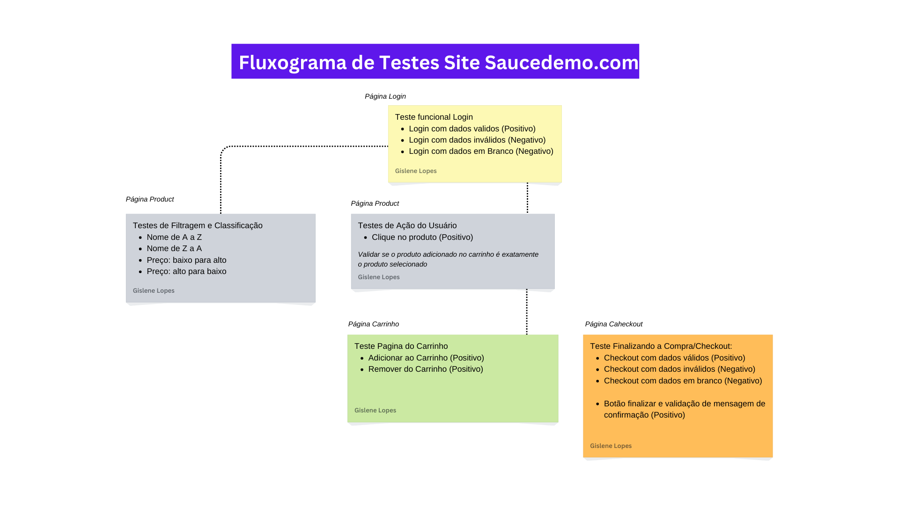

<h1 align = "center">
	
</h1>

<h2 align = "center">
	
</h2>

<h3>
	
	
	
	
	
</h3>


# ✅ Sobre 

O projeto **Saucedemo** foi desenvolvido utilizando uma ferramenta da empresa SauceLabs, que é especializada em testes automatizados para funcionalidades de e-commerce.

No âmbito desse projeto, eu automatizei um teste na página Saucedemo, que faz parte da plataforma SauceLabs. Especificamente, utilizei a ferramenta para validar diversos fluxos de uso, como login de usuário, navegação pelos produtos, adição de itens ao carrinho e finalização de compras.

Esta automação ajudou a garantir a estabilidade e funcionalidade do site, proporcionando uma experiência de usuário mais confiável e eficiente.

---

## 🔁 Modelo Conceitual


<h2 align = "center">
	
</h2>


---

## 🚀 Tecnologias Utilizadas 

- Java
- Selenium WebDriver
- Junit
- Cucumber
- Gherkin
- IDE Eclipse
- Maven project

---

## ▶ Como executar os testes

Os testes são execultados na classe **RunnerBase** que fica localizada no seguinte caminho **src/test/java/runner**. Nesse projeto temos os seguintes testes: 

#### Login 👤
Para realizar testes de login, basta chamar o nome da variavél e o nome do teste que deseja validar.

Confira o exemplo abaixo:

```bash
	# Teste para validar o Login com dados validos
	login.testeLoginPositivo();
```


#### Produto 📦
Para realizar testes de produto, basta chamar o nome da variável e o nome do teste que deseja validar.

Confira o exemplo abaixo:

```bash
	#Teste para validar seleção de produtos
	produto.testeSelecionarProduto();
```

#### Filtrar ✅
Para realizar testes filtrar e classificar, basta chamar o nome da variavél e o nome do teste que deseja validar.

Confira o exemplo abaixo:

```bash
	# Teste para validar a seleção de filtros de produtos
	filtrar.testeFiltrarDeAaZ();
```
#### Carrinho 🛒
Para realizar testes de carrinho, basta chamar o nome da variavél e o nome do teste que deseja validar.

Confira o exemplo abaixo:

```bash
	#Teste adionar produto no carrinho
	carrinho.testeAdicionarProdutoAoCarrinho();
```
#### Checkout ✅

Para realizar testes de checkout, basta chamar o nome da variavél e o nome do teste que deseja validar.

Confira o exemplo abaixo:

```bash
	#Teste para validar o checkout com dados válidos
	checkout.testeCheckoutComDadosValidos();
```

** Observação: ** Não se preocupe, deixarei todos os testes possíveis comentados na classe RunnerBase para serem executados de forma rápida. 😊 

---

## ⬇ Como baixar o projeto

```bash

# Clonar o repositório
$ git clone https://github.com/gislene-lopes/Projeto_Automacao_Testes_Saucedemo.com.git

# Entrar no diretório
$ cd projeto saucedemo v1

# Instalar o projeto
$ yarn install

# Iniciar o projeto
$ yarn start

```
---

## Autor (a)
Gislene Lopes da Silva